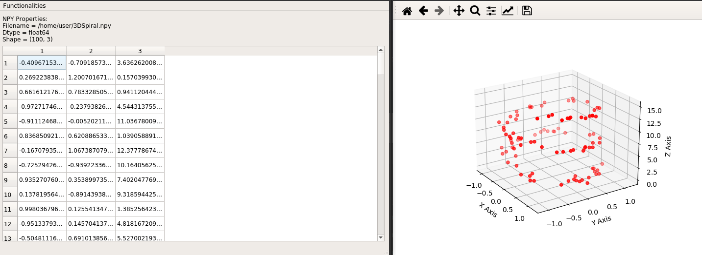
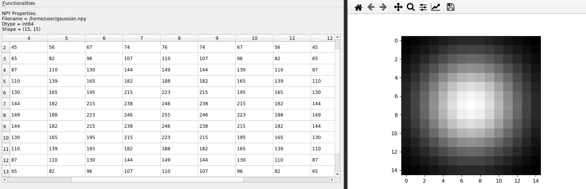
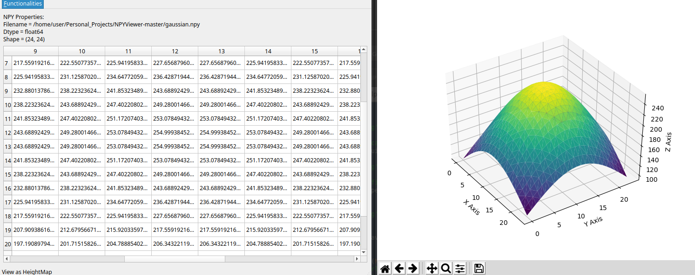

# NPYViewer 1.2
###  A simple GUI tool that provides multiple ways to view the contents of .npy files containing 2D NumPy Arrays 

#### Plot 3-column 2D numpy arrays containing 3D Coordinates as 3D Point Clouds

#### Plot 2D numpy arrays as Grayscale Images

#### Vizualize HeightMaps from 2D numpy arrays

### Installation:
* Original development in Ubuntu 20.04
* pip3 install -r requirements.txt

### Execution:
* python3 NPYViewer.py

### Current Features:
* Open and view .npy files that contain 2D NumPy Arrays and Lists, as spreadsheets
* Save the contents of .npy files as .csv
* Convert .csv files to .npy format
* Plot 2D numpy arrays as Grayscale Images
* Plot 2D numpy arrays containing 3D Coordinates as 3D Point Clouds
* Vizualize HeightMaps from 2D numpy arrays
* GUI developed using PyQT5

### TODO:
* Add/Remove Rows & Columns
* Copy/Paste Rows & Columns
* Save as .mat file
* Data search and filtering
* Modify content datatypes
* Handle data with more than 2 dimensions
