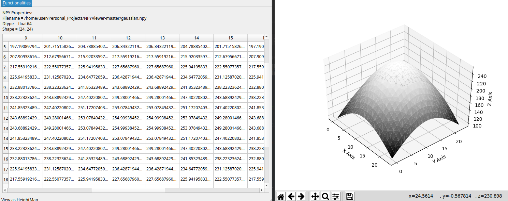
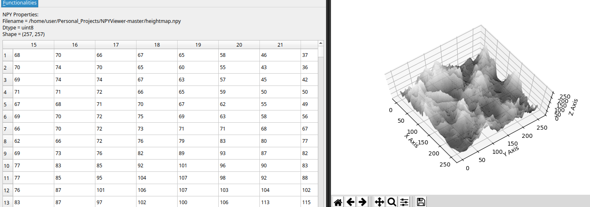

# NPYViewer 1.23
###  A simple GUI tool that provides multiple ways to load and view the contents of .npy files containing 2D NumPy Arrays.

#### Plot 3-column 2D numpy arrays containing 3D Coordinates as 3D Point Clouds

#### Plot 2D numpy arrays as Grayscale Images

#### Visualize Heightmaps stored as 2D numpy arrays
 

### Installation:
* Original development in Ubuntu 20.04 and Python 3.8.8
* Also tested on Windows 10
* pip3 install -r requirements.txt

### Execution:
* python3 NPYViewer.py

### Current Features:
* Open and view .npy files that contain 2D NumPy Arrays and Lists, as spreadsheets
* Convert .npy files to .csv format
* Convert .csv files to .npy format
* Convert .npy files to .mat format (compatible with MATLAB and Octave)
* Plot 2D numpy arrays as Grayscale Images
* Plot 2D numpy arrays containing 3D Coordinates as 3D Point Clouds
* Visualize Heightmaps stored as 2D numpy arrays
* GUI developed using PyQT5

### TODO:
* Add/Remove Rows & Columns
* Copy/Paste Rows & Columns
* Data search and filtering
* Modify content datatypes 
* Handle data with more than 2 dimensions
* Visualize adjacency matrices as graphs

### Changes since last version:
* Convert .npy files to .mat format (compatible with MATLAB and Octave)
* Open window remembers the path of the last opened file between consecutive executions
* Partial support for arrays with custom dtypes
