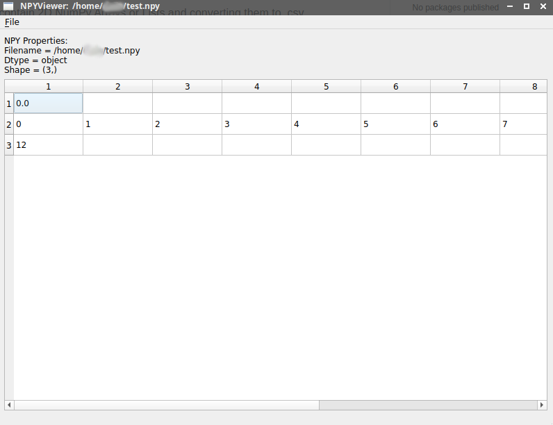

# NPYViewer
A simple GUI tool for viewing .npy files that contain 2D NumPy Arrays or Lists and converting them to .csv.

Installation:
* Original development in Ubuntu 20.04
* pip3 install -r requirements.txt

Execution:
* python3 NPYViewer.py

Current Features:
* Open and view .npy files that contain 2D NumPy Arrays and Lists, as spreadsheets
* Save the contents of .npy files as .csv
* GUI developed using PyQT5

TODO:
* Add/Delete Rows & Columns
* Copy/Paste Rows & Columns
* Save as .npy file
* Data search and filtering
* Modify content datatypes
* Visualize images
* View data as 2D/3D Plot
* Handle data with more than 2 dimensions
